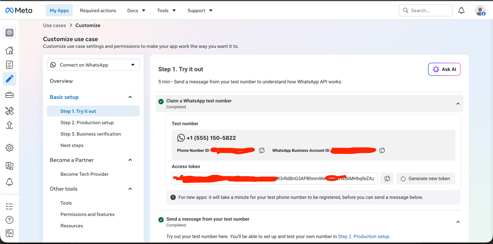
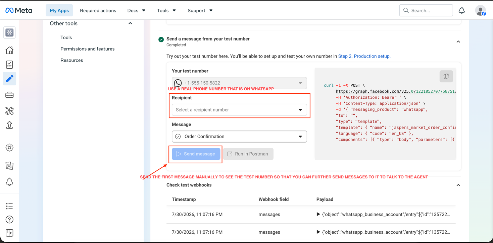
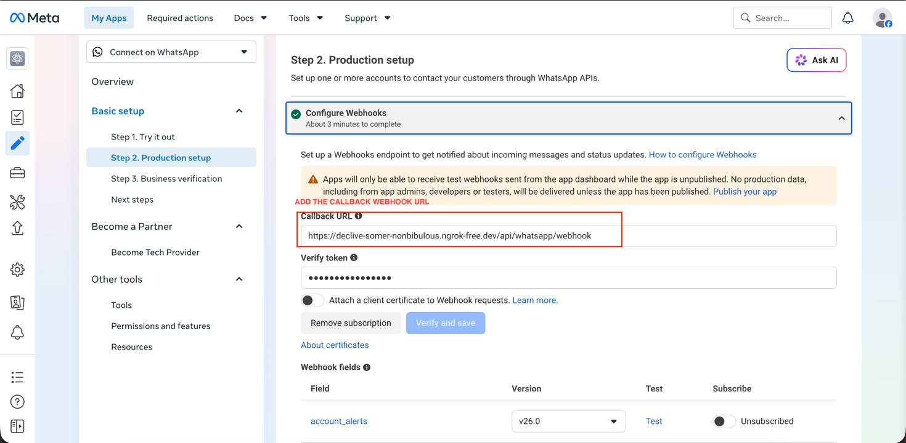
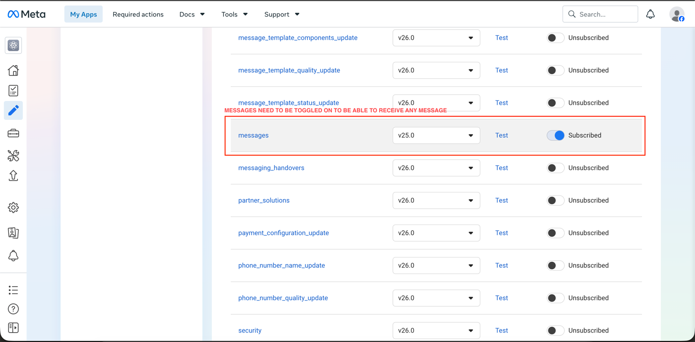

# Wize AI
Encourage students to use AI to build responsible learning habits instead of developing a dependency on it.

## How to run the app
### Prerequisites

- Docker and Docker Compose (Better Docker Desktop installed)
- Gemini API key
- Google Cloud OAuth client (Client ID + Secret) with Calendar scope
- Meta WhatsApp Business API app (access token, phone number ID, verify token)
- ngrok (or another HTTPS tunnel), for WhatsApp
- Ports `5173`, `3001`, `5432` must be free

### Run with Docker Compose

1. Clone the repo
2. `cp .env.example .env`
3. Get the latest `api` and `web` image tags from the [package page](https://github.com/rebakevin?tab=packages&repo_name=wizeai) and put them in `.env` (`API_IMAGE_TAG`, `WEB_IMAGE_TAG`)
4. Fill in the rest of the values in `.env`
5. `docker compose up -d`
6. Open `http://localhost:5173`
7. `ngrok http 3001`
8. Set the ngrok URL + `/api/whatsapp/webhook` as the webhook URL in the Meta App Dashboard
9. Connect to all 3 platforms - Canvas as student, WhatsApp, Google Calendar in the web app
10. With Meta properly set up, send your first message from Meta to WhatsApp to interact for the first time with the test number. From that point on, you can talk to the agent freely.

Test number & credentials

Sending a test message

Webhook callback URL

Webhook field subscription

### Platform setup

- [Google Cloud setup](docs/GOOGLE_CLOUD_SETUP.md)
- [Meta developer setup](docs/META_SETUP.md)